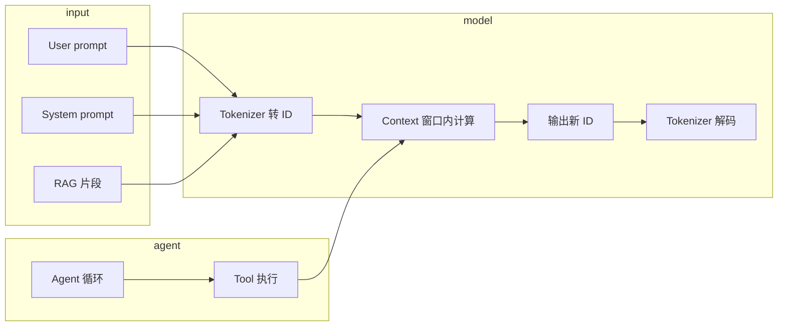

# LLM 与 Agent 相关概念梳理

本文档把大语言模型、训练与推理、上下文、RAG、提示词、工具、Agent 等概念串成一条线，便于团队对齐术语。与实现细节以本仓库代码为准处会单独标注。

---

## 1. LLM（大语言模型）

**含义**：在大量文本上训练得到的**序列概率模型**：给定已出现的 token 序列，预测下一个（或下一块）token 的分布。它不是数据库，也不具备持久「记忆」；**单次请求内**能利用的只有本次拼进输入里的内容。

**在本仓库**：推理通过 HTTP 调用 **OpenAI 兼容** 的 `chat/completions` 网关（见 `internal/llm`）；权重与算力在远端，本地负责路由、鉴权、RAG、Agent 与工具执行。

---

## 2. Transformer 与训练 / 推理

| 概念 | 简述 |
|------|------|
| **Transformer** | 以**自注意力**为主干的网络结构，便于并行、建模长距离依赖；现代多数 LLM 的骨干。 |
| **训练（预训练等）** | 用海量数据更新模型参数，学习语言与领域统计规律；还可有 SFT、RLHF 等对齐阶段。 |
| **推理（Inference）** | 不更新权重，只做前向计算；日常对话、RAG、Agent 均在推理侧。 |

---

## 3. Token、Tokenizer：文本 ↔ 数字

**Tokenizer（分词器）**：把字符串切成 **token**（子词级单元），每个 token 对应词表里的一个**整数 ID**。

**典型路径**：

1. **编码**：用户文本 + 系统提示 + RAG 片段等 → 分词 → `token_id` 序列。  
2. **模型内部**：ID → 嵌入向量 → 多层 Transformer → 输出 logits。  
3. **解码**：对 logits 采样或贪心得到新 token_id → 循环直到结束符 → **decode** 回可读字符串。

**注意**：不同模型的词表与切分规则不同；**token 数 ≠ 字数**。计费和「还能塞多少」通常按 token 计。

---

## 4. Context（上下文）与 Context Window（上下文窗口）

**Context（上下文）**  
当前这次请求里，模型能**同时看到**的整段输入（常见组成：`system` + 历史多轮 + `user` + 工具返回文本等）。可理解为**本轮推理的临时工作记忆**：请求结束或新开一轮，除非你在服务端**自己拼历史**再发，否则不会自动跨请求延续。

**Context window（上下文窗口）**  
单次前向允许的**最大 token 长度**（由模型与实现共同决定）。超出需：**截断、摘要、RAG 只塞 Top-K 片段、分块处理**等。

---

## 5. RAG（检索增强生成）

**目的**：从向量库、搜索引擎或代码索引中，取出与用户问题**最相关**的片段，写入 prompt 的固定区块（如「参考资料」），让回答**有依据、可引用**，减轻幻觉。

**在本仓库**：`internal/rag` 检索后，由 `internal/agent` 在 `buildPrompt` 中拼入「检索到的相关代码片段」等块（可通过环境变量关闭或调 Top-K）。

---

## 6. Prompt、Prompt Engineering、User / System

| 术语 | 含义 |
|------|------|
| **Prompt（提示词）** | 发给模型的**可控文本整体**（规则、任务、格式、示例、检索内容均可包含）。 |
| **Prompt engineering（提示词工程）** | 系统性地设计、迭代、评测提示结构，用较小改动换取更稳定、可解析的行为。 |
| **User prompt** | 用户本轮的自然语言任务（「要做什么」）。 |
| **System prompt** | **人设 + 全局规则 + 输出约定**（例如角色、语言、工具调用格式）。在多数 API 中有独立字段，适合作为「底座」长期约束行为。 |

**在本仓库**：`internal/agent` 中的 `SYSTEM_PROMPT` 即系统侧约束；用户消息与历史来自 `internal/memory` 与单次 `msg`。

---

## 7. Tool（工具）与 MCP

**Tool（工具）**  
模型不直接访问文件系统或外网；由**宿主程序**根据模型输出或结构化协议去执行动作（读文件、调 API、查库），再把**结果文本**写回对话，模型继续生成。

**MCP（Model Context Protocol）**  
一种**统一描述工具与上下文如何接入**的协议思路：工具列表、参数 schema、调用方式可标准化，减少每个产品各写一套适配层。本质是**工具/资源的接入规范**，不替代模型本身。

**在本仓库**：工具为进程内注册的 `read_file` / `write_file`（见 `internal/agent`），通过模型输出的**约定字符串**触发（见下节「仓库对照」），尚未接入 MCP 服务端。

---

## 8. Agent（智能体）与 Agent Skill

**Agent**  
在**循环**中：理解目标 →（可选）分解子任务 → **决定是否调用工具** → 执行工具 → 将结果写回上下文 → 再推理，直到给出最终答案。核心是 **模型 + 控制流 + 工具**，不是单次问答。

**Agent skill**  
通常指**技能说明文档**：何时启用、输入输出、限制、示例；供人或编排器检索，并**摘要或全文**进入 prompt。实现形态可以是 Markdown、带元数据的说明文件、或 MCP 资源描述等。

---

## 9. 元数据层 vs 指令层（格式层）

| 层 | 典型字段 / 内容 | 主要服务对象 |
|----|-----------------|--------------|
| **元数据层** | `name`、`description`、版本、标签、权限 | **人、路由、UI、注册表**：快速理解「是什么能力」、做筛选与授权。 |
| **指令层（格式层）** | System/User 里的规则、JSON schema、示例、分步说明 | **模型**：约束输出结构、工具协议、失败时如何重试等。 |

工程上常见做法：元数据用于列表与发现；**真正进 context 的**是「元数据摘要 + 必要指令片段」，避免无意义占满上下文窗口。

---

## 10. 从用户提问到回答（总览）

---

## 11. 与本仓库实现的对照（便于读代码）

| 概念 | 本仓库中的位置（示例） |
|------|------------------------|
| LLM 网关 / 配置 | `internal/llm`（含多租户 profile 注册表时见 `profile.go`、`registry.go`） |
| System prompt | `internal/agent` → `SYSTEM_PROMPT` |
| 会话上下文（多轮） | `internal/memory` |
| 租户隔离 | `internal/tenant`，Agent 工具读写 `workspace/<tenant>/` |
| RAG | `internal/rag`，在 `buildPrompt` 中注入检索块 |
| 工具触发格式 | 模型需输出 `[TOOL:read_file]路径` 或 `[TOOL:write_file]路径\|\|内容`（与 `SYSTEM_PROMPT` 一致）；解析见 `parseToolCall` |
| HTTP 对话入口 | `api/handler.go`、`api/stream_handler.go` |

---

## 12. 延伸阅读（官方 / 社区）

- OpenAI Chat Completions / Messages 角色说明（理解 system / user / assistant）。  
- 所使用网关（如 One API、智谱 OpenAPI）文档中的 **模型名、鉴权、流式协议**。  
- MCP 规范以所选 SDK 或官方文档版本为准。

---

更新说明：概念层描述不绑定某一模型版本；若你升级网关或模型，请以服务商文档为准校对 token 上限与消息格式。
